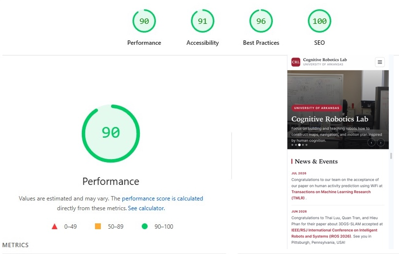

## **Cognibotics Lab's website**

- Demo here: [https://www.cogniboticslab.org](https://www.cogniboticslab.org/)



- Migrate from
    - Ruby version: 3.4.7
    - Version: Jekyll 4.4.1

- To **PHP** (version 8.1, tested on Namecheap hosting)
    - Prevent **recompiling** $\rightarrow$ **copying** new files to host everytime we add new data
    - Focus on adding/modifying data (folder **data**) without touching and copying from static output html to hosting.

### **Development**

Clone from our GitHub
``` shell
git clone https://github.com/cogniboticslab/lab_website.git
```

### **Design**
- Please make changes to your own design in **includes**
- Specific page located at **inlcudes/*.php**

### **Database (static YAML):**
- **config.yml**: General website information
- **news.yml**: News
- **projects.yml**: Projects
- **publications.yml**: Publications
- **team.yml**: All lab members
- **members**: This folder contains individual information
    - Page: member.php?**id=username**, extract id from URL, then point to file: /data/members/**username.yml**
    - Please refer to example file: **/data/members/member.yml** for more infomation.


### **Host the website**
- Copy this repo to a server/host supporting **PHP** (tested on version 8.1) without SQL.
- Test on Namecheap: [https://www.cogniboticslab.org](https://www.cogniboticslab.org/)
